# My Programming Journey

<link rel="stylesheet" href="https://fonts.googleapis.com/css2?family=Material+Symbols+Outlined:opsz,wght,FILL,GRAD@48,400,0,0" />
<link rel="preload" href="./programmingJourneyAssets/CoderZ1.png" as="image">
<link rel="preload" href="./programmingJourneyAssets/CoderZ1.png" as="image">
<link rel="preload" href="https://raw.githubusercontent.com/AzlanCoding/azlancoding.github.io/main/iframe-browser/Screen%20recording%202022-06-30%2011.25.19.gif" as="image">
<link rel="preload" href="https://raw.githubusercontent.com/AzlanCoding/azlancoding.github.io/main/iframe-browser/InstallGuidePhotos/13.png" as="image">
<link rel="preload" href="https://raw.githubusercontent.com/AzlanCoding/azlancoding.github.io/main/iframe-browser/InstallGuidePhotos/2.png" as="image">
<link rel="preload" href="./programmingJourneyAssets/DMA0.mp4" as="video">
<link rel="preload" href="./programmingJourneyAssets/DMA1.mp4" as="video">
<link rel="preload" href="./programmingJourneyAssets/DMA2.mp4" as="video">
<link rel="preload" href="./programmingJourneyAssets/DMA3.mp4" as="video">
<link rel="preload" href="./programmingJourneyAssets/BOT0.png" as="image">
<link rel="preload" href="./programmingJourneyAssets/BOT1.png" as="image">
<link rel="preload" href="./programmingJourneyAssets/BOT2.png" as="image">
<link rel="preload" href="./programmingJourneyAssets/BOT3.png" as="image">
<link rel="preload" href="./programmingJourneyAssets/PROG0.mp4" as="video">
<link rel="preload" href="./programmingJourneyAssets/PROG1.png" as="image">
<link rel="preload" href="./programmingJourneyAssets/PROG2.png" as="image">
<link rel="preload" href="./programmingJourneyAssets/PROG3.mp4" as="video">
<link rel="preload" href="./programmingJourneyAssets/MATH0.gif" as="image">
<link rel="preload" href="./programmingJourneyAssets/MATH1.gif" as="image">
<link rel="preload" href="./programmingJourneyAssets/MATH2.mp4" as="video">
<link rel="preload" href="./programmingJourneyAssets/MATH3.mp4" as="video">
<link rel="preload" href="./programmingJourneyAssets/SS0.webm" as="video">
<link rel="preload" href="./programmingJourneyAssets/VIRT0.png" as="image">
<link rel="preload" href="./programmingJourneyAssets/ICH0.mp4" as="video">
<link rel="preload" href="./programmingJourneyAssets/ROBO0.mp4" as="video">
<link rel="preload" href="./programmingJourneyAssets/ROBO1.jpg" as="image">
<link rel="preload" href="./programmingJourneyAssets/Hypr0.png" as="image">
<link rel="preload" href="./programmingJourneyAssets/Hypr1.png" as="image">
<link rel="preload" href="./programmingJourneyAssets/Hypr2.png" as="image">
<link rel="preload" href="./programmingJourneyAssets/Hypr3.png" as="image">
<link rel="preload" href="./programmingJourneyAssets/Hypr4.png" as="image">
<link rel="preload" href="./programmingJourneyAssets/Hypr5.png" as="image">
<link rel="preload" href="https://raw.githubusercontent.com/AzlanCoding/scrcpyMediaController/main/Screenshots/Screenshot_02-Jun_10-38-55_26599.png" as="image">
<link rel="preload" href="https://raw.githubusercontent.com/AzlanCoding/scrcpyMediaController/main/Screenshots/Screenshot_02-Jun_10-58-03_1099.png" as="image">
<link rel="preload" href="https://raw.githubusercontent.com/AzlanCoding/scrcpyMediaController/main/Screenshots/Screenshot_30-May_20-25-30_20743.png" as="image">
<link rel="preload" href="./programmingJourneyAssets/SMC3.png" as="image">
<!--link rel="preload" href="./programmingJourneyAssets/YCEP0.png" as="image">
<link rel="preload" href="./programmingJourneyAssets/YCEP1.png" as="image"-->
<link rel="preload" href="./programmingJourneyAssets/YCEP2.jpg" as="image">
<link rel="preload" href="./programmingJourneyAssets/YCEP3.jpg" as="image">
<!--link rel="preload" href="./programmingJourneyAssets/YCEP4.png" as="image"-->

  <h1 id="title">My Programming Journey</h1>
  
Original <a target="_blank" href="https://codepen.io/alanhouser/pen/aErrQJ">CSS Timeline</a> by Alan Houser Modified and Animated by AzlanCoding Image Carousel by AzlanCoding

  <ul class="timeline">
    <li class="event" data-date="2019">
      <h3><strong>Participated in Innovation Project (IVP)</strong></h3>
      
This is where I was first introduced to programming. I participated for the Innovation Project in Primary 5 and was shortlisted for the Booth Presentation. I programmed a Microbit to automatically close the prototype window when rain was detected. This project was programmed using block programming in the browser.

    </li>
    
    <li class="event" data-date="2020">
      <h3>Started Learning Python</h3>
      
Immediately after I finished my Primary School Leaving Examination (PSLE), I learnt the Python Programming Language using a book my mum bought for me and a pygame tutorial from YouTube. Using the pygame tutorial, I made my first 2D game.
   
    </li>
    
    <li class="event" data-date="2021">
      <h3>Started Learning C++</h3>
      
After enrolling into Hai Sing Catholic School and their Robotics Club, I found out that they use C++ to program their robots and immediately started to learn it using W3Schools C++ tutorial and tried writing.

      

      
      <h3>Started learning Autonomous Programming</h3>
      
As a member of the robotics Club, I played my part by learning how to program robots. My school taught me Lego Mindstorms Block Programming in block programming. Learning how to autonomously program lego constructed bots to complete tasks. I also wrote a lot of pseudo code in my robotics journal. 

      

      
      <h3><strong>Won 2nd Team Placing in CoderZ Competition</strong></h3>
      
Nearing the end of the year, I participated in an online team competition for CoderZ Competition and won 2nd team placing.

      

        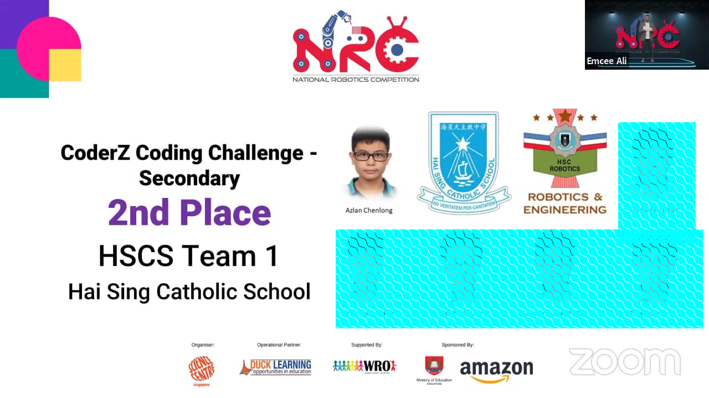
        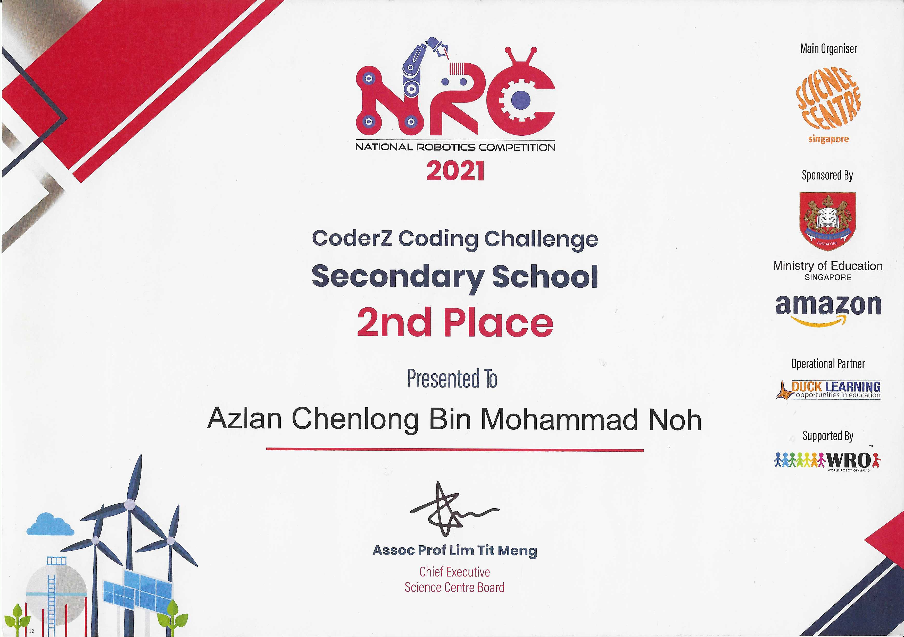
      

      

      
      <h3>Continued Sharpening Programming Skills</h3>
      
Over the holidays, I got a new laptop and sharpened my Python and C++ skills and played around with PIP. Moreover, I learnt how to use the Chromebook I just got in october as I was to use it in school as my Personal Learning Device (PLD).

    </li>
    
    <li class="event" data-date="2022">
      <h3>Started Learning HTML, JavaScript and CSS</h3>
      
As I got very vexed by the restrictions on my Chromebook controlled by Mobile Guardian, I started to look at Mobile Guardian's source code which was easy to access because it was a Chrome Extension. Through this, I discovered that Mobile Guardian did not check content in iframe elements, allowing blocked websites to be accessed through an Iframe. I thus set out to built my own website to test out this vulnerability. Soon I learnt restrictions like <code>X-Frame-Options</code> and <code>Content-Security-Policy</code> and how to get around them (through extensions). I developed the website into a Progressive Web App (for fun) and added the experimental tab strips for a more browser look. I also added full details of the exploit so that Mobile Guardian will hopefully find it and patch the vulnerability. You can find the exploit <a target="_blank" href="https://github.com/AzlanCoding/iframe-browser-pwa">here</a>.

      

        </image>
        install guide</a>.">
        install guide</a>.">
      

      

      
      <h3>Started using C++ to Program VEX Robots</h3>
      
VEX Robots are made of aluminium with stronger and faster motors. Using C++, I learnt how to program robots to move both with dual controller input and autonomously.

      

      
      <h3>Attempted to Make My Own DMA</h3>
      
Both the students and the teachers got annoyed with various issues with my schools Device Management Application (DMA). Thus, during the June holidays, I was determined to make a new one that works better. I set off to learn socket programming, server-client connection, how to build a Python <code>Flask</code> Server (A web server), <code>Qt</code> for python (a.k.a <code>PyQt</code>, a UI framework like Flutter to build Cross Platform Apps like VLC media player, Shotcut, Virtualbox and many more! Learn more about it <a target="_blank" href="https://www.qt.io/product">here</a>.), proxy servers (for web filtering) and how <code>MITM</code> (Man In The Middle) attacks work (so that I can prevent the user from visiting a blocked site). There were just too many things to learn and it was very overwhelming for me at that time. I was not able to complete my goal in time but I learnt a lot of things along the way.

      

        <video src="./programmingJourneyAssets/DMA0.mp4" data-desc="A video of me learning networking by making a chat room."></video>
        <video src="./programmingJourneyAssets/DMA1.mp4" data-desc="A test run of the Ignite Browser"></video>
        <video src="./programmingJourneyAssets/DMA2.mp4" data-desc="Nudity detection test using a project I found online and a completely random <a target='_blank' href='https://i.ytimg.com/vi/6z8vSXX7nM4/sddefault.jpg'>video thumbnail image</a> I found from my Discord Bot's logs."></video>
        <video src="./programmingJourneyAssets/DMA3.mp4" data-desc="Testing a facial recognition authentication system for the DMA. (It didn't work)"></video>
      

      

      
      <h3><strong>Participated in First Vex Competition</strong></h3>
      
I participated in a friendly match with various secondary schools, and a primary school at Rulang Primary School. The competition is called Spin Up and you can watch a video about it <a target="_blank" href="https://www.youtube.com/watch?v=wIZgvVDZc2Y">here</a>. Even though my team didn't win, it gave me the opportunity to do autonomous programming at a competition level. I wrote and rewrote my code many many times. You can see them in the <code>VEXCODE</code> folder <a href="https://github.com/AzlanCoding/code-for-vex" target="_blank">here</a>. (This repository also consist of code for other competitions)

      

      
      <h3>Created my First Discord Bot</h3>
      
After getting a Discord account earlier that year, I was fascinated by the various bots available and wanted to make my own for my class's notes server. I programmed a simple bot to notify classmates when a new note was released and play music from youtube into a voice channel (which often failed as it depended on <code>yt-dl</code>).

      
<strong>Note: </strong>The screenshots shown below were taken from a later date. The original name of the bot was <code>note-tifier-bot</code>.

      

        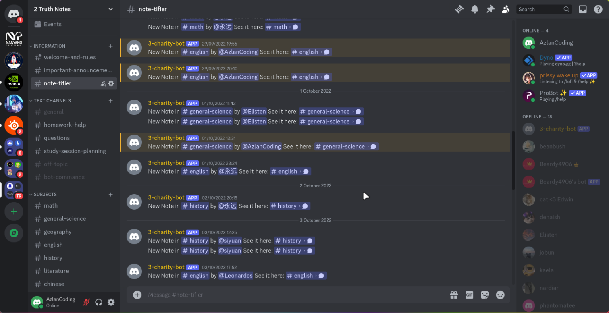
        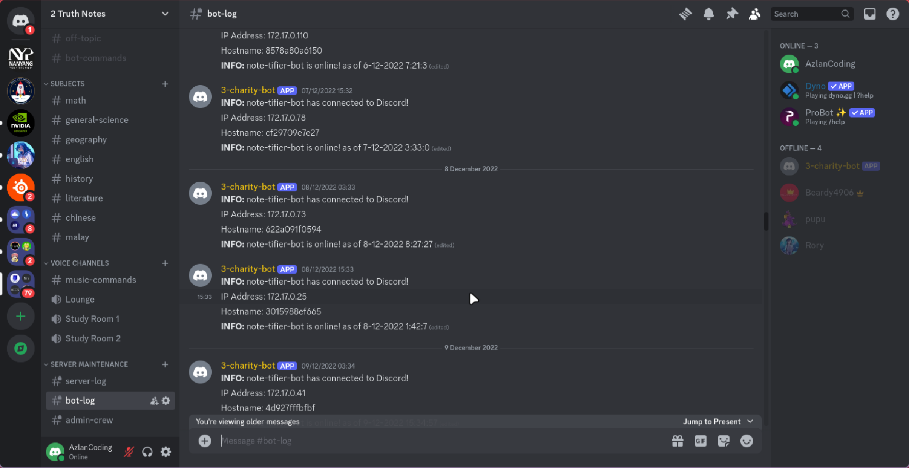
        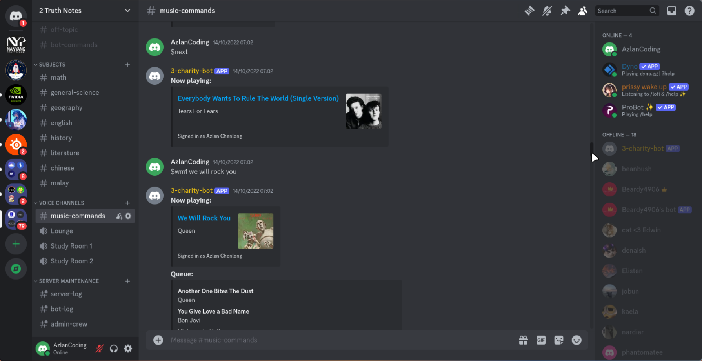
        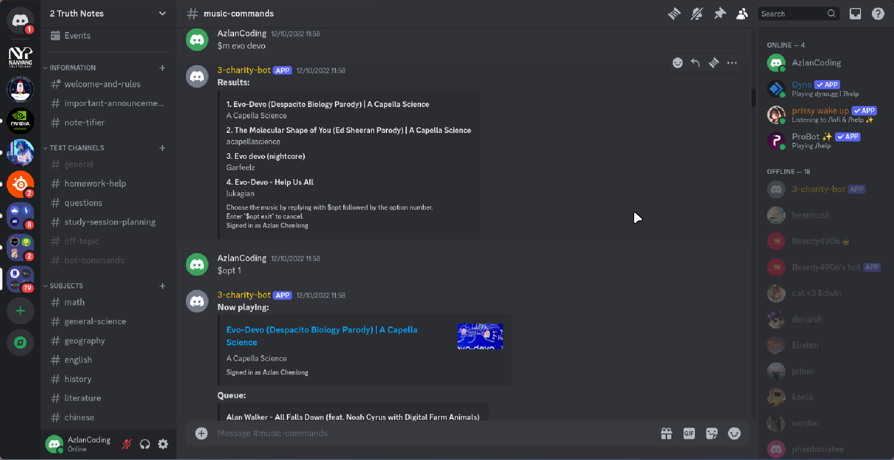
      

      

      
      <h3>Learnt Lots of Other Programming Stuff</h3>
      
Apart from refining my C++ skills during the December holidays, I also explored other things like Emulation (Using RetroArch). I spent most of that holiday preparing a PowerPoint presentation to teach my juniors how to program C++ for VEX Robots. I also tried to make an Attendance Tracking System for my Robotics Club using QT to learn more about the framework so that I can use QT for the new DMA I wanted to make. However, I never completed it due to the lack of support, QT was just too complicated for me. Moreover, I repurposed my first discord bot for my new secondary 3 class. The new bot helps keep track of assignments that are yet to be due. Once they are due, they are automatically removed from the list. Through a command, I can also send this list to my class's WhatsApp group chat thanks to <a target="_blank" href="https://github.com/robvanderleek/mudslide">Mudslide</a>. Finally, I tried to compile and run <a target="_blank" href="https://github.com/CMU-Perceptual-Computing-Lab/openpose">OpenPose</a> (Motion Capture) on my laptop. It didn't work because I did not have an NVIDIA GPU (Graphics Processing Unit). I wasted quite a bit of time installing <code>CUDA</code> and <code>PyTorch</code> libraries that were useless without the NVIDIA GPU. It was through this incident I learnt what a GPU is and the diffrence between an Integrated GPU and a Dedicated GPU.
 
      

        <video src="./programmingJourneyAssets/PROG0.mp4" data-desc="Attendance Tracking System facial recognition test"></video>
        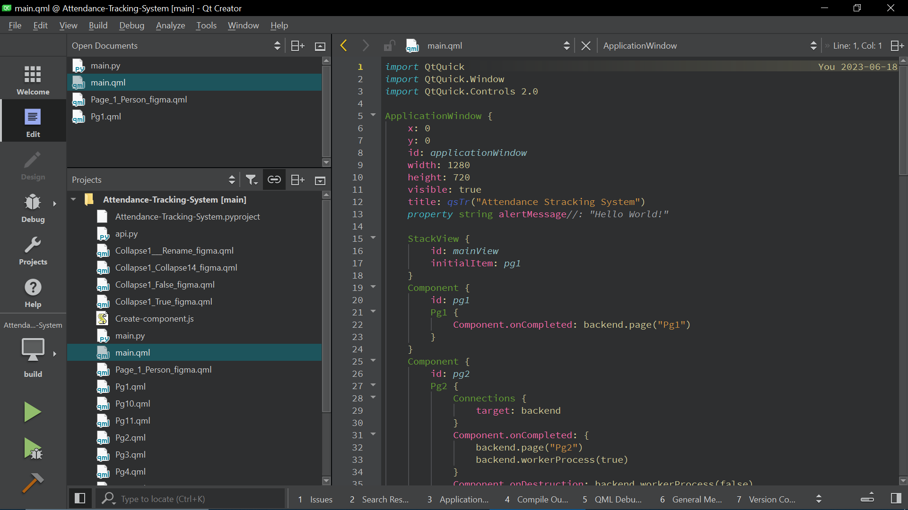
        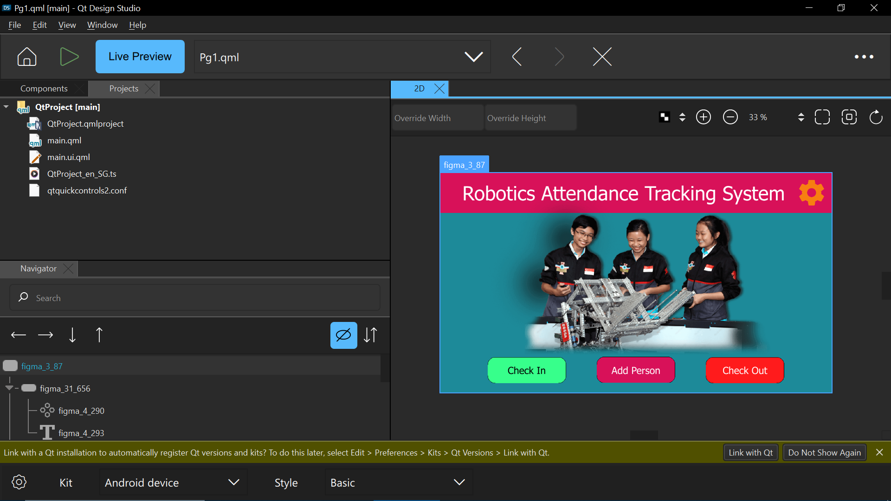
        <video src="./programmingJourneyAssets/PROG3.mp4" data-desc="Attendance Tracking System test"></video>
      

    </li>
    
    <li class="event" data-date="2023">
      <h3><strong>Participated in Second Vex Competition (Nationals)</strong></h3>
      
Due to the lack of programmers, I was the programmer for two separate teams. Thus I had to program 2 Dual Controllet Driver control code and 4 Autonomous code as each bot can have two starting positions to choose from during the match. We played <a href="https://www.youtube.com/watch?v=wIZgvVDZc2Y" target="_blank">Spin Up</a> again but this time it was Nationals, the 1st placing would represent Singapore and travel overseas to play against other countries. I lost track of which team won what award but I think we did reasonably well.

      

      
      <h3>Applied Python Skills to Math Modeling Projects</h3>
      
Using my knowledge on Python, I applied it to my Math Modeling Projects. The first one was a Beauty Rating Software. It determined which of my classmates were the most beautiful based on the golden ratio. You can find more about it <a href="https://github.com/AzlanCoding/Beauty-Rating-Software"  target="_blank">here</a> along with the code written for the project. The second one, which I did not upload as the sample data would contain most of my classmates faces, measured the angle in which the basketball was thrown at as well as create an quadratic equation to show the trajectory of the basket ball thrown, using a sample video. These projects gave me the chance to experiment with Artificial Intelligence using Python and allowed me to play around with various python packages such as <code>torchvision</code>, <code>matplotlib</code>, <code>numpy</code> and <code>opencv-contrib-python</code>.  *For the first project, when I was training the Facial Detection Model on my laptop, I was not aware that there was already a trained model (.pt file) in the project's repository.

      

        I have obtained permission from the people in this video to put this GIF here.">
        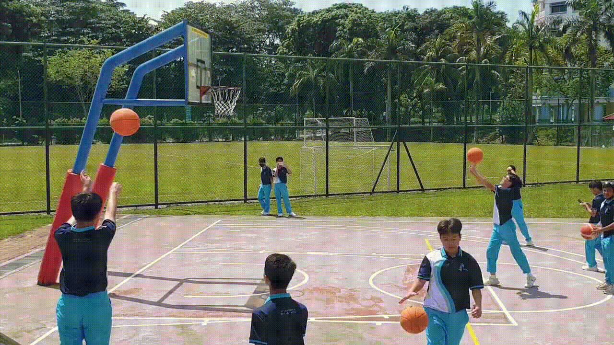I have obtained permission from the people in this video to put this GIF here.">
        <video src="./programmingJourneyAssets/MATH2.mp4" data-desc="A failed test run of my program when under testing. The final generated graph is upside down."></video>
        <video src="./programmingJourneyAssets/MATH3.mp4" data-desc="A test run of the software I wrote for face data collection. Many frames in the screen recording were dropped due to lack of CPU resources. Take not that this is a screen recording of 2 displays side by side."></video>
      

      

      
      <h3>Started Work on <a target="_blank" href="https://github.com/AzlanCoding/ScreenShare">ScreenShare</a></h3>
      
ScreenShare is a simple browser to browser screen sharing application between 2 devices. It was initially intended to help my classmates and my Math teacher screen mirror our Chromebook and her iPad to the Projector but I later discovered that <code>WebRTC</code> (The technology used by ScreenShare) does not work on iPads. It then became a prototype for the Integrated Classroom Hub (Another prototype that I will talk about later). You can see the project and try it out yourself <a target="_blank" href="https://github.com/AzlanCoding/ScreenShare">here</a>.

      

        <video src="./programmingJourneyAssets/SS0.webm" data-desc="A Demo of ScreenShare from the Receiving end. When a YouTube Video is played on the client, there is smooth playback."></video>
      

      

      
      <h3>Explored Virtual Machines and Other Stuff</h3>
      
During the June Holidays, I got a new, powerful laptop that had 64GB of RAM, 2TB of SSD Storage, NVIDIA RTX 3050 6GB Laptop GPU and a 13th Gen i7 13700H Intel Processor. This gave me enough resources to explore virtual machines. I experimented with Ubuntu LTS 22.04, Kali Linux and Android 6 and 13 (Android 6 was excessively slow and Android 13 did not work). This allowed me to learn linux commands and how to operate the command line interfaces in both Windows and Linux. During this holiday, I also finished up work for ScreenShare. It was here I discovered that there was no <code>Web-RTC</code> support for iPad and that the School's Internal Firewall does not allow WebRTC functionality. I think it is due to the blockage of the <code>UDP</code> Protocol and device to device communication (local network server hosting?). Either way, I concluded that the only way for ScreenShare to work was if I set up my own WIFI in my classroom, which I did. I now introduce to you the Integrated Classroom Hub (ICH), an all in one classroom manager.  The ICH fixes multiple ICT problems in my classroom such as poor WIFI connection that constantly disconnects. Using a spare Singtel Mesh Router I had lying around in my house, the ICH auto log in to the school WIFI and start a hotspot which goes out through the ethernet port of my laptop to the Singtel Mesh Router. The ICH is also supposed to come with a better web filtering system but it was never completed before Secondary 4. The proposed web filtering system uses a transparent proxy to monitor and block every single outgoing request to the internet from the students. This is better as the school would only need to maintain the ICH in each classroom rather than doing software checks on every students' laptop every semester. The ICH also starts 2 Python <code>Flask</code> Servers. The first one running at port 80 handles shortcuts. When connected to the Wifi, if you type <code>igc/</code> in a chrome browser, it will redirect you to Google Classroom (*IGC stands for ICON Google Classroom). It does this by DNS Hijacking the domain <code>igc</code> which works despite not being a valid domain name. The second one running at port 443 is a website that manages reminders, important dates, homework and overdue homework for my class. The website also comes with various tools such as an image to text converter and WebRTC Screen Sharing to screen mirror (Cast) the students Chromebook to the ICH (Which is also connected to the projector. DNS Hijacking also meant that I could get any domain I wanted for the website, except that the website would only be accessible when connected to the ICH's WIFI. This also meant the ICH was to replace the current discord bot which kept going offline (cause my free bot hosting was not very reliable).

      

        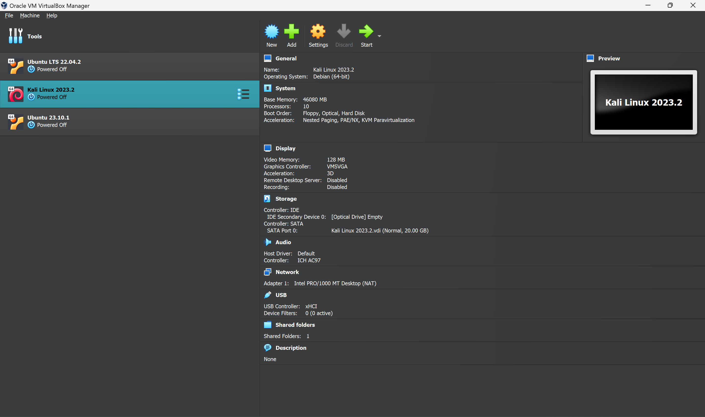
        <video src="./programmingJourneyAssets/ICH0.mp4" data-desc="ScreenShare porting to the ICH"></video>
      

      

      
      <h3><strong>Won 3rd Team Placing for Friendly Over Under Competition</strong></h3>
      
We played a friendly tournament with many other secondary schools at Anglo-Chinese School (Independent). This season's game can be found <a href="https://www.youtube.com/watch?v=dvDqEI7qO34" target="_blank">here</a>. My team won 3rd team placing, there was other 2 teams in my school that also managed to get 2nd Team Placing (They allianced each other while we allianced with Futrun Robotics Academy). It was an interesting experience especially since the teammates in out alliance were significantly younger than us. My research on <strong>Odemetry</strong> also paid off. Odometry is the use of data from encoders/rotation sensors or motion sensors to estimate the change in position over time, it is often used in robotics to determine a robot’s position relative to a known starting location. The calculation is very complex and I had to figure all of it out myself. It made our autonomous task more consistent as our bot will not be affected if it hits another bot or goes off target. You can check out the code in the <code>PROS</code> folder <a href="https://github.com/AzlanCoding/code-for-vex" target="_blank">here</a>. I learnt and used the PROS API on my own just for this competition and it definitely paid off.

      

        <video src="./programmingJourneyAssets/ROBO0.mp4" data-desc="Odometry test run. The robot crashes into the walls but still gets exactly where its supposed to get to."></video>
        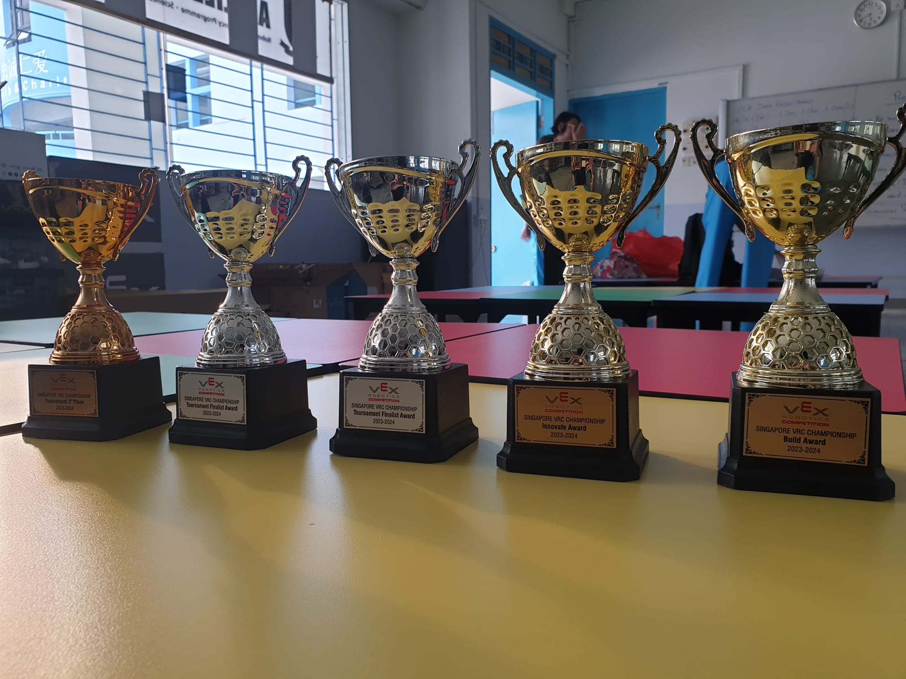
      

      

      
      <h3>Finished ICH (except transparent proxy) and created Bootable Ubuntu Drive</h3>
      
During the December holidays, I finished the development for the Integrated Classroom Hub prototype except the transparent proxy. It was ready for my class to use in the upcoming year. I also converted my Ubuntu LTS 22.04 Virtual Machine into a bootable thumbdrive that My laptop booted from. It made my workflow faster as I had been using ubuntu everyday for most of my homework and revision and using a bootable thumbdrive meant faster performance and less graphic rendering errors along with access to the NVIDIA GPU.

      <iframe allowfullscreen src="https://www.youtube.com/embed/f54U9EadVmQ" style="border-radius: 1em; border: none; margin: auto; aspect-ratio: 16/9; display: block; width: 75%"></iframe>
    </li>
    
    <li class="event" data-date="2024">
    <h3>Upgraded Ubuntu</h3>
    
I wanted to install <a target="_blank" href="https://hyprland.org/">Hyprland</a>. So I tried to update my ubuntu 22.04 to 23.10 but i broke it along the way. I backed up my files by mounting a thumb drive through tty and transferring my files to that thumb drive. Then I started with a fresh new installation of Ubuntu 23.10 and used this <a target="_blank" href="https://github.com/JaKooLit/Debian-Hyprland">install script</a> to help me install hyprland. Because the script was for debian (at the time I used it), I needed to find all my missing dependencies from the install log. I've since successfully installed hyprland.

    

      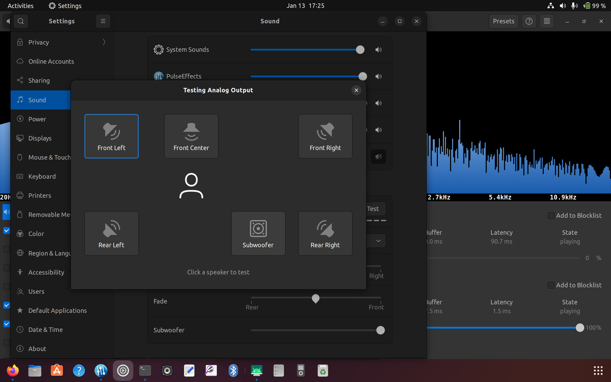
      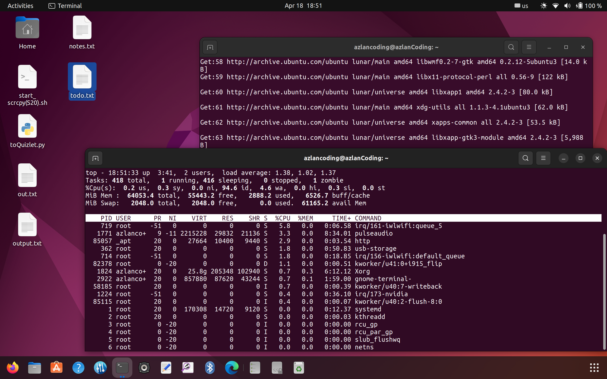
      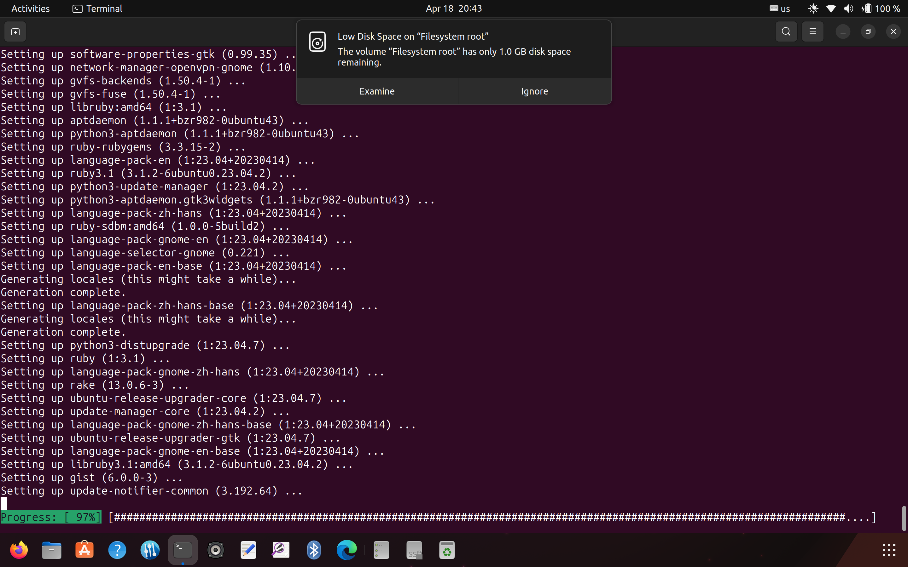
      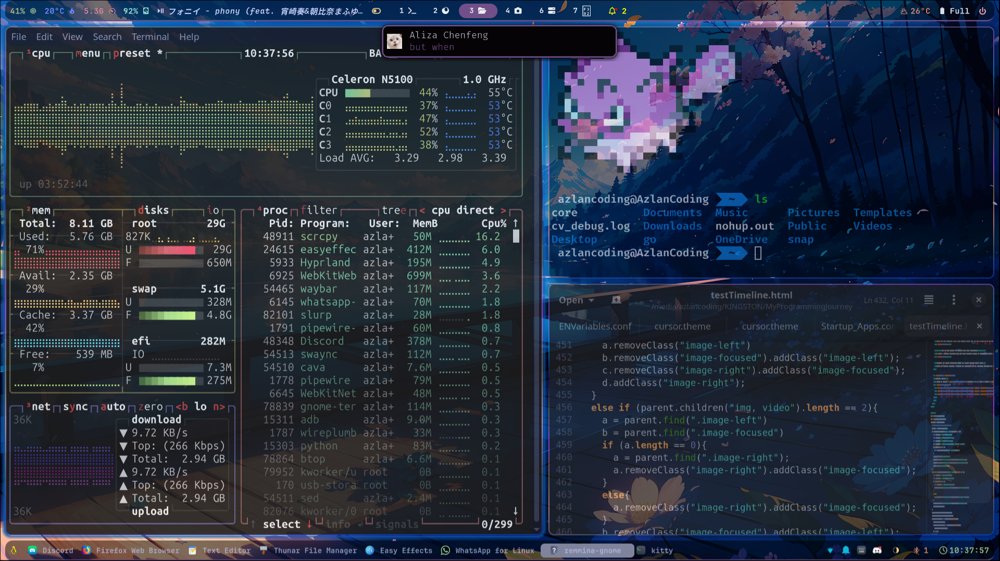(Screenshot taken when running on spare laptop)">
      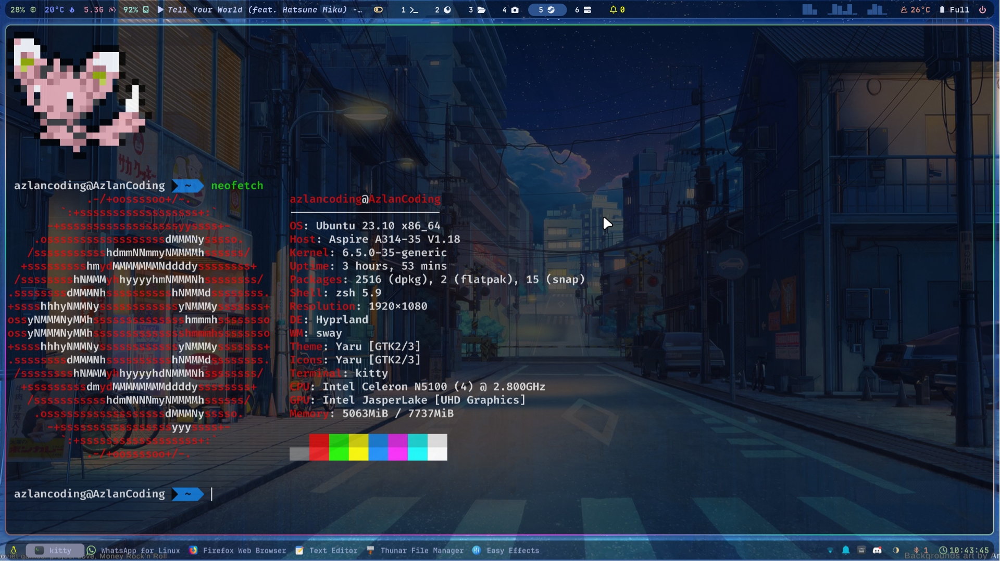(Screenshot taken when running on spare laptop)">
      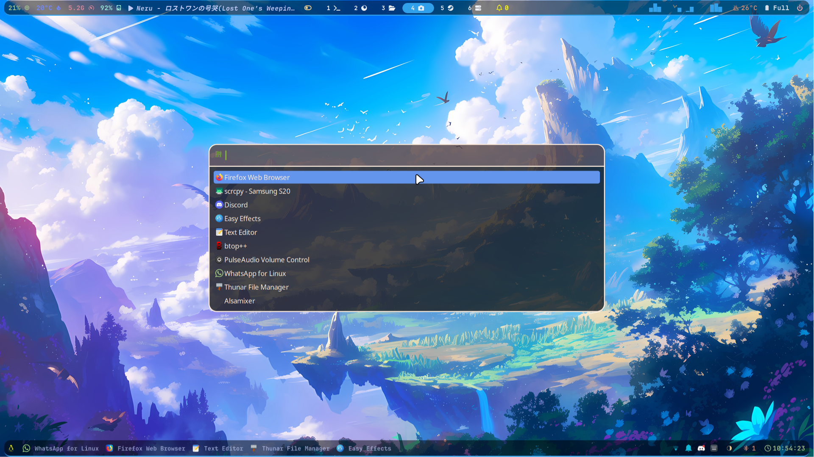(Screenshot taken when running on spare laptop)">
    

    

    
    <h3>Created this page</h3>
    
I created this page as part of my portfolio for my Early Admissions Exercise. The image carousel was handwritten by me (and not ChatGPT). The original <a target="_blank" href="https://codepen.io/alanhouser/pen/aErrQJ">CSS Timeline</a> is by Alan Houser. I changed the colours to suit my blog and animated it using jQuery.

    

    
    <h3>Created <a target="_blank" href="https://github.com/AzlanCoding/scrcpyMediaController/">scrcpyMediaController</a></h3>
    
I wrote this script when I got tired studying for Organic Chemistry in preparation for my GCE O-Level examination. Slowly, I kept fixing some bugs until I was satisfied with it. I might compile a proper release binary or maybe even learn C and make a pull request to scrcpy after my exams.

    

      
      
      
      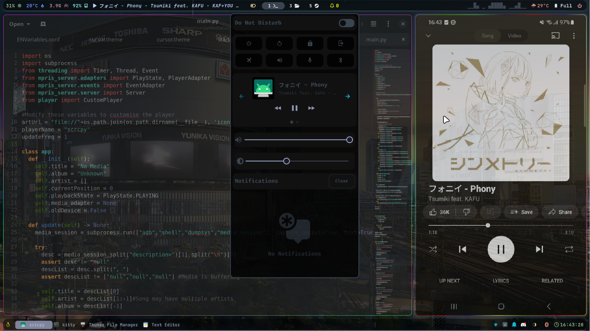
    

    

    
    <h3><strong>Participated in Youth Cyber Exploration Program (YCEP) and achieved 11th Placing in class</strong></h3>
    
I wanted to explore cybersecurity so I joined this free program. I learnt a lot of things and had a lot of fun. When the final Capture The Flag (CTF) competiion came on the third day, I achieved 11th placing. I learnt that in the future, if I am stuck at one challenge, I should give up and try another one first, otherwise I wold just be wasting time thinking. I have been invited to attend the central YCEP CTF competition and will definitely attend it on 22nd June 2024.

    

      <!--img src="./programmingJourneyAssets/YCEP0.png" data-desc="Screenshot of ">
      
      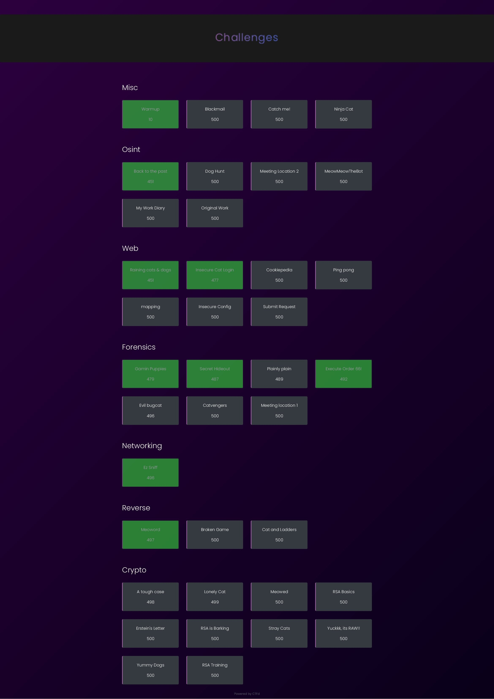This image is very long, clicking on it may not allow you to see the entire image.">
      This image is very long, clicking on it may not allow you to see the entire image.">
      <!--img src="./programmingJourneyAssets/YCEP4.png" data-desc="Screenshot of scrcpyMediaController in Hyprland"-->
    

    </li>
  </ul>

